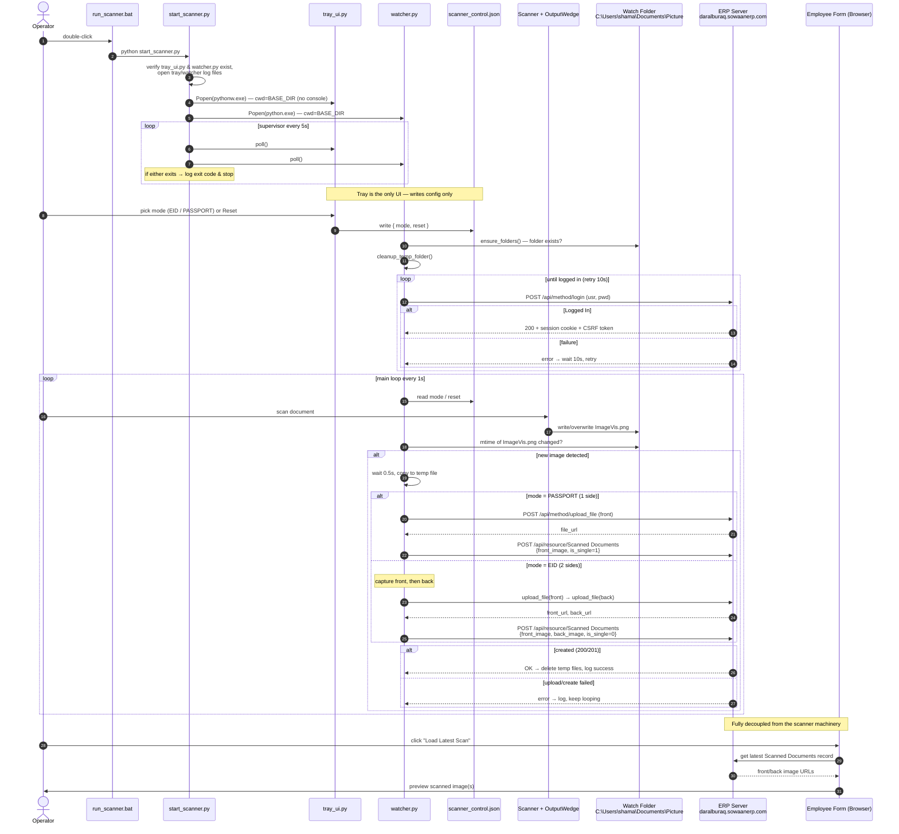

# Scanner Utility — Sequence Flow

End-to-end flow from launching `run_scanner.bat` to the "Load Latest Scan" button
in the Employee form.

## Why this design

- **`.bat` → `start_scanner.py` supervisor launching two processes** — the launcher's only
  job is to start and babysit two independent workers and surface crashes (exit codes + log
  files). Keeping the tray UI and the uploader in separate processes means one can fail or be
  restarted without taking down the other.
- **`tray_ui.py` via `pythonw.exe`, `watcher.py` via `python.exe`** — the tray is a GUI that
  should have no console window (`pythonw`), while the watcher's console/logs are useful for
  diagnosing scan/upload issues.
- **`scanner_control.json` as the IPC channel** — the tray and watcher never talk directly.
  The tray *writes* `mode`/`reset`; the watcher *reads* it once per loop. A plain JSON file is
  simple, restart-safe, and needs no sockets — at the cost of being poll-based, not event-driven.
- **Folder + mtime polling instead of talking to the scanner** — the OutputWedge hardware only
  knows how to *write an image file to disk*. So the watcher bridges "file appeared" → "record
  created in ERP." The filesystem path IS the integration contract.
- **Retry/guard logic on login, upload, and create** — this runs unattended on a kiosk PC, so
  every network step must fail safe and keep looping rather than crash.
- **The "Load Latest Scan" button is decoupled** — it just reads the most recent
  `Scanned Documents` record over HTTP, unaware of the scanner pipeline that produced it.

## Known gotcha

`tray_ui.py` uses a **relative** `CONTROL_FILE = "scanner_control.json"` while `watcher.py`
uses an **absolute** `os.path.join(BASE_DIR, "scanner_control.json")`. They resolve to the same
file only because `start_scanner.py` launches both with `cwd=BASE_DIR`. If the tray is ever
started from a different working directory, mode/reset changes silently write to a different
file and never reach the watcher. Making both absolute would remove this fragility.
